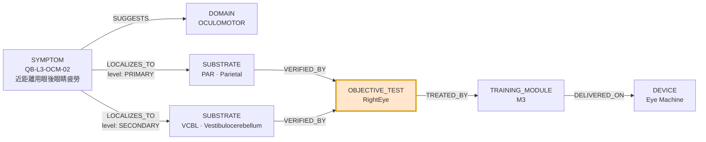
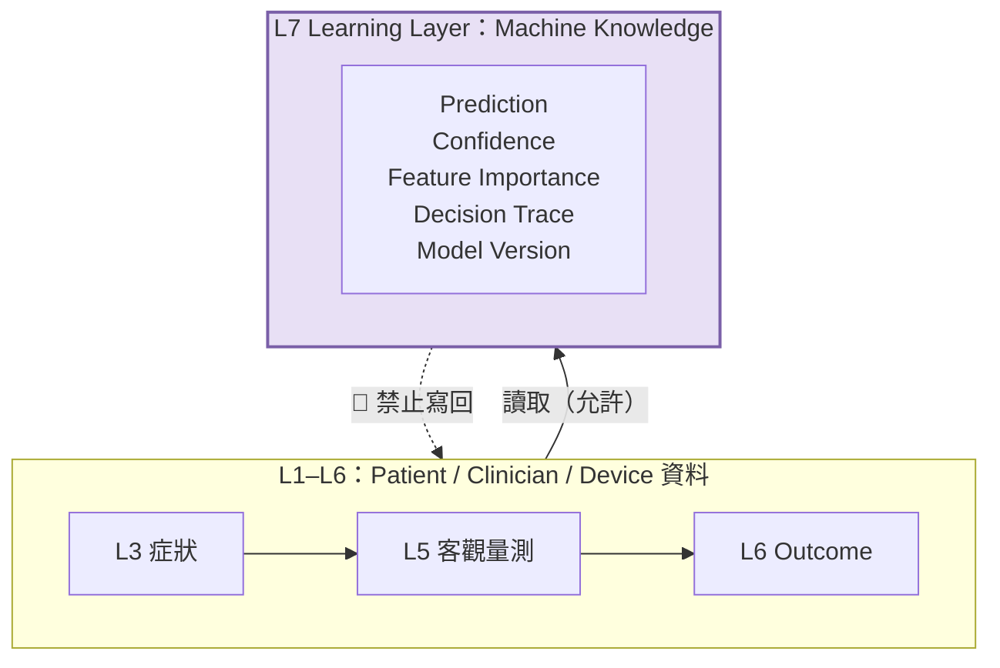

# CLINICAL_KNOWLEDGE_GRAPH.md v0.1

**建立依據:** ChatGPT Architecture Review 2026-07-27，Required Change #6
**Date:** 2026-07-27
**Author:** Claude Code
**Status:** 🔴 **DRAFT — 結構定義完成，內容（節點與邊）待填**
**Pending:** ChatGPT 架構審 ☐ / Gemini 臨床審 ☐ / PM 核准 ☐

---

## 1. 這份文件是什麼

架構審的定位：

> 這份文件未來就是 **Rule Engine**，也是 **Explainable AI 的核心**。

範例路徑（架構師原文）：

```
Reading Fatigue → Oculomotor → Parietal → Vestibulo-cerebellum
                → RightEye → M3 → Eye Machine
```

**本文件定義這張圖的 schema 與不變量（invariants），不填內容。**
節點與邊的臨床內容屬 Phase 4，由 ChatGPT + 專家填寫。

**與 Neural Mapping Matrix 的關係：**
Matrix 是這張圖其中**一種邊**（`LOCALIZES_TO`）的表格化填寫介面。
Matrix 填完 → 匯入為圖的邊。兩者不是重複，是同一資料的兩個視圖。

---

## 2. 節點類型（Node Types）

| 類型 | 說明 | 來源 | 範例 |
|---|---|---|---|
| `SYMPTOM` | 病人自陳的症狀題 | Question Bank（L3 / L4） | `QB-L3-OCM-02` 近距離用眼後眼睛疲勞 |
| `DOMAIN` | BCDM L3 六大功能領域 | BCDM §三 | `OCULOMOTOR` |
| `SUBSTRATE` | 神經解剖／功能基質 | Neural Mapping Matrix 的 16 欄 | `PAR`（Cortex – Parietal） |
| `OBJECTIVE_TEST` | 客觀量測 | BCDM L5 | `RightEye`、`BTrackS`、`MMT` |
| `TRAINING_MODULE` | 訓練模組 | 現行系統 | `M3` |
| `DEVICE` | 執行裝置 | 現行系統 | `Eye Machine` |
| `CLINICAL_FLAG` | 診斷／狀況 | BCDM L2 | `BPPV`（狀態型 enum，見 §5.3） |
| `MODIFIER` | 領域調整參數 | 規格 v1.0 §4–§7 | `VESTIBULAR_TOLERANCE` |

⚠️ **`SYMPTOM` 節點的 id 必須是 Question Bank 的題號**，不得另立。
題目改版 → 節點 id 不變，`form_version` 記在邊的屬性上。

---

## 3. 邊類型（Edge Types）

| 邊 | 從 → 到 | 屬性 | 說明 |
|---|---|---|---|
| `SUGGESTS` | SYMPTOM → DOMAIN | — | 症狀屬於哪個功能領域 |
| `LOCALIZES_TO` | SYMPTOM → SUBSTRATE | `level`: PRIMARY / SECONDARY / SUPPORTIVE | ← **Neural Mapping Matrix 就是填這個** |
| `VERIFIED_BY` | SUBSTRATE → OBJECTIVE_TEST | `metric` | 哪個客觀量測能驗證這個基質 |
| `CONSTRAINS` | CLINICAL_FLAG → TRAINING_MODULE | `restriction` | 規格 §9 的 MODALITY_RESTRICTION |
| `GATES` | MODIFIER → TRAINING_MODULE | `threshold` | 規格 §4–§7 的領域調整參數 |
| `TREATED_BY` | SUBSTRATE → TRAINING_MODULE | — | 哪個模組訓練這個基質 |
| `DELIVERED_ON` | TRAINING_MODULE → DEVICE | — | 模組跑在哪台機器上 |

**邊的層級只用三級**（PRIMARY / SECONDARY / SUPPORTIVE），不用數值 ——
依 Architecture Review Required Change #5：

> 目前沒有任何人可以合理說 Parietal = 0.73 / FEF = 0.41。這是假精確。

---

## 4. 範例路徑（架構師原文的形式化）



> 🔴 **注意橘色節點。** `OBJECTIVE_TEST` 不是路徑上的裝飾 ——
> 它是**強制關卡**。見 §5.1。

⚠️ 上圖的臨床內容（Parietal 是否為 PRIMARY、是否該接 VCBL）**未經審查**，
純粹用來示範 schema。真實內容 Phase 4 填。

---

## 5. 🔴 結構不變量（Invariants）

**這一節是本文件最有價值的部分。**
以下規則不是文件裡的一句話，而是**圖的結構限制**，可以機械檢查。
把治理規則寫成不變量，才不會在實作時被繞過。

### 5.1 INV-1｜症狀到處方，必須經過客觀測試節點

> 規格 v1.0 §15 規則 8：「最終處方前必須加入 BCF 客觀檢測結果。」
> 規格 §16：「問卷決定容量，**客觀評估決定真正要訓練的神經目標**。」

**不變量：**
```
任何從 SYMPTOM 到 TRAINING_MODULE 的路徑，
必須至少經過一個 OBJECTIVE_TEST 節點。
```

🚫 **禁止的邊：** `SYMPTOM → TRAINING_MODULE`（直連）
🚫 **禁止的邊：** `SUBSTRATE → TRAINING_MODULE`，除非該 SUBSTRATE 有
　　　　　　　　 `VERIFIED_BY` 邊且該次評估確實有對應的客觀資料

**為什麼這條最重要：** 規格 §15 有四條規則在講同一件事
（規則 2 不得產生腦區診斷 / 規則 3 不得產生 M1–M8 處方 /
規則 4 不得決定 PBM 參數 / 規則 8 必須加入客觀結果）。
四條都是散文，都可以被「不小心」繞過。
寫成圖的可達性限制後，**繞過它需要新增一條被明文禁止的邊** ——
那是 code review 抓得到的，而散文抓不到。

**可執行的驗收：** 圖建好後跑一次可達性檢查，
列出所有不經 `OBJECTIVE_TEST` 就能到達 `TRAINING_MODULE` 的 SYMPTOM。
**結果必須為空集合。**

### 5.2 INV-2｜側化鐵律

> 7/25 §九（零容忍）：OD/OS 不推方向／不側化；
> 中腦與皮質同側、小腦對側；OPN 中線不側化。

**不變量：**
```
· OCULOMOTOR domain 的 SYMPTOM 節點，其 LOCALIZES_TO 邊
  不得帶任何 laterality 屬性
· PONS/OPN 節點不得出現在任何帶 laterality 的邊上
· 指向小腦 SUBSTRATE 的側化，必須成對出現（雙候選）
```

**雙候選規則**（White Paper §3.1.3）：
> 單一 dysmetria 無法區分 lesion level。證據不足 → 輸出 primary + alternative，
> 或降級 `UNSPECIFIED_CEREBELLAR_DYSMETRIA`。**禁硬指。**

→ 圖的表現：小腦相關症狀允許**多個 PRIMARY 邊**。
Neural Mapping Matrix 的狀態欄會標「雙候選 N 個」，這是**刻意的，不是漏改**。

🚫 若某小腦症狀只有**單一** PRIMARY 邊 → 違反 §3.1.3，須降級為
　 `UNSPECIFIED_CEREBELLAR_DYSMETRIA` 或補上 alternative。

### 5.3 INV-3｜Clinical Flag 是狀態，不是布林

依 Architecture Review Required Change #3：

```
CLINICAL_FLAG.status ∈ { PRESENT, INACTIVE, RESOLVED, UNKNOWN, NOT_ANSWERED }
```

**`CONSTRAINS` 邊必須依 status 分流** —— 不得只看「有沒有這個 flag」：

| status | 語意 | 對 CONSTRAINS 的效果 |
|---|---|---|
| `PRESENT` | 目前活動中 | 限制生效 |
| `INACTIVE` | 曾有，目前不活動（如偏頭痛緩解期） | 限制降級，不解除 |
| `RESOLVED` | 已痊癒（如已復位的 BPPV） | 限制解除，但保留病史脈絡 |
| `UNKNOWN` | 臨床端不知道 | ⚠️ **保守處理，視同 PRESENT** |
| `NOT_ANSWERED` | 沒人填 | ⚠️ **保守處理，視同 PRESENT** |

> 🔴 **`UNKNOWN` 與 `NOT_ANSWERED` 必須是兩個值，不可合併。**
> 前者是「醫師評估過但無法確定」，後者是「這個欄位根本沒被填」。
> 兩者的資料品質意義完全不同 —— 前者是臨床資訊，後者是流程缺口。
> ⚠️ 架構審只列了四個值（Present / Inactive / Resolved / Unknown），
> 第五個 `NOT_ANSWERED` 是 Claude 依 SG-1 增補的，**待架構師確認**。

> ⚠️ **進行性疾病不應允許 `RESOLVED`。** 架構師自己指出
> 「Parkinson: Resolved 幾乎不可能」。
> 建議每個 CLINICAL_FLAG 節點帶 `allowed_status[]` 屬性，
> 進行性疾病的 allowed_status 排除 RESOLVED。**待 Gemini 臨床審定義清單。**

### 5.4 INV-4｜Daily Function 不得有 LOCALIZES_TO 邊

「不敢出門」不指向任何腦區。DFN 症狀只能有 `SUGGESTS → DOMAIN` 邊，
以及指向 `NONLOC` 的邊。

🚫 `DFN 症狀 → 任何解剖 SUBSTRATE` 的 LOCALIZES_TO 邊
（混入會產生虛假的定位信心 —— 與 White Paper §4.1 虛高% 同源病灶）

⚠️ 此為 Claude 先前提出、**尚未經架構師裁決**的建議。

### 5.5 INV-5｜Layer 7 節點不得有指回 L1–L6 的邊

見 `BCF_DATA_DICTIONARY` Layer 7 定義。AI 產出不得被當成觀察值讀回。
詳見 §6。

---

## 6. Layer 7（Learning Layer）在圖中的位置

依 Architecture Review Required Change #6，新增 Layer 7 存放 AI 自身產出。

**圖上的表現：Layer 7 是一個只進不出的觀察層。**



### 🔴 為什麼「禁止寫回」必須是硬規則

若 AI 的預測被寫回 L1–L6，之後會被當成**觀察值**讀出來：

```
AI 預測「此病人小腦受損」
  → 存進 L3（誤）
  → 下次評估讀 L3，看到「小腦受損」
  → 當成病人自陳的事實
  → 模型用自己的輸出訓練自己
  → confidence 上升，但沒有任何新資訊進來
```

這是 White Paper §4.1「虛高%」在機器學習上的版本 ——
**分母沒變，分子卻自己長大。**

### 可執行的驗收（Layer 7 的存在測試）

> **把整個 Layer 7 刪掉，L1–L6 必須仍然臨床完整，系統必須仍能運作。**

若刪掉 L7 之後有任何臨床功能壞掉，代表某處已經把 AI 產出當成資料源 ——
`INV-5` 已被違反。這個測試可以定期跑，不需要人工稽查。

---

## 7. 填寫順序（Phase 4）

```
1. SUBSTRATE 節點          ← 已備：Neural Mapping Matrix 的 16 欄
2. SYMPTOM 節點            ← 已備：Question Bank 的題號
3. LOCALIZES_TO 邊         ← ★ Neural Mapping Matrix 就是這一步的填寫介面
4. SUGGESTS 邊             ← 機械產生（症狀 → 其所屬 domain）
5. VERIFIED_BY 邊          ← 需 L5 客觀量測的能力清單
6. TREATED_BY 邊           ← 需 M1–M8 模組的作用機轉定義
7. DELIVERED_ON 邊         ← 需裝置清單
8. CONSTRAINS 邊           ← 規格 v1.0 §9 病史限制
9. GATES 邊                ← 規格 v1.0 §4–§7 四個 Modifier
10. 跑 INV-1..INV-5 檢查   ← 全過才算 Phase 4 完成
```

⚠️ **步驟 5–7 需要的資料本文件沒有** ——
M1–M8 的作用機轉、RightEye 能驗證哪些基質、裝置清單，
都在現行 repo 或臨床端，**Claude 尚未 grep**。
依 7/25 §九，不得從記憶重建。

---

## 8. 待裁決

**ChatGPT**
1. `NOT_ANSWERED` 是否納入 CLINICAL_FLAG status（第五個值，§5.3）
2. INV-4（DFN 不得 localize）是否成立
3. 節點與邊的儲存形式：獨立 collection？JSON 檔？圖資料庫？
4. Neural Mapping Matrix 匯入為 `LOCALIZES_TO` 邊的轉換規則

**Gemini**
5. 進行性疾病的 `allowed_status` 清單（哪些不得 RESOLVED，§5.3）
6. INV-2 的小腦雙候選在圖上的表現是否正確反映 §3.1.3

**PM**
7. 步驟 5–7 所需的 M1–M8 機轉定義與裝置清單從哪裡取得

---

*本文件由 Claude Code 依 Architecture Review Required Change #6 產出。*
*結構與不變量為實作層設計；所有臨床內容待 Phase 4 與治理鏈填寫。*
